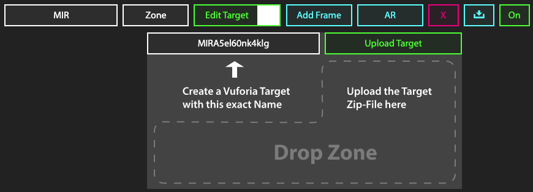
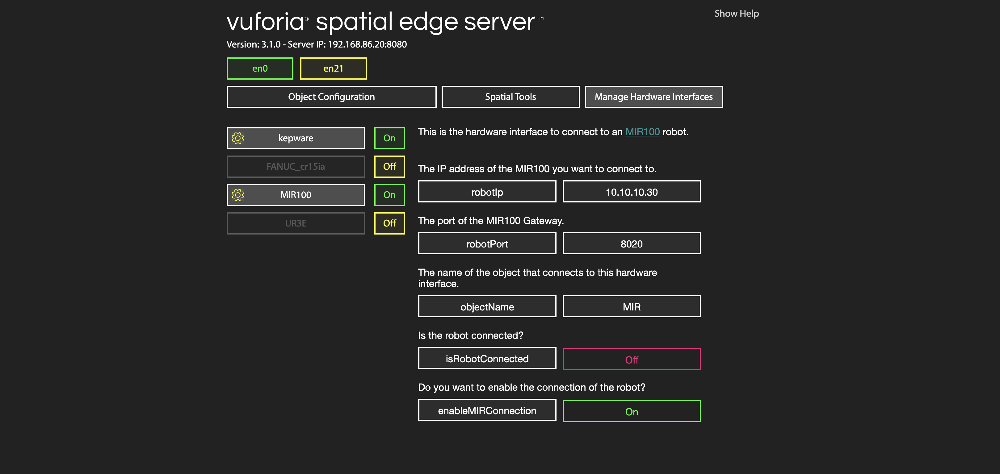

## KineticAR Interfaces

This is a reference to build a [**Vuforia Spatial Toolbox** (VST)](https://forum.spatialtoolbox.vuforia.com ) KineticAR prototype using robotic interfaces for any moving robot in 2D or 3D. 
This is based on our [**Kinetic AR** UX framework](https://dl.acm.org/doi/abs/10.1145/3371382.3378394) and it works with two components:
* **[Robotic Addon Interface](../../README.md)** [To connect to the robot hardware]
* **[Motion Tool](tools/motion/motionTool.md)** [AR UI when looking at the robot with your mobile device]


It allows a connection to the robot and a full spatial synchronization 
between the robot coordinate system and the Vuforia groundplane coordinate system. 
It also allows for path planning and motion visualization in AR in real-time.

### Getting Started

These instructions will explain how to setup the Kinetic AR robotic addons and tools. 
You will have to clone or download the code for the VST repositories as explained later.

This tutorial is based on the interface built for an [MIR100](https://www.mobile-industrial-robots.com/en/solutions/robots/mir100/) Automated Guided Vehicle. But can be adapted to any other robot.
The MIR example makes use of a Rest API and WebSockets in order to communicate with the AGV. 
You will need to adapt the code to be able to communicate with your specific hardware.

#### Prerequisites

The robot you want to use needs a remote connection and you need to understand the communication protocols involved to:

* Get the robot status (current position/rotation and if it is moving or not)
* Send a move command to the robot in order to send it to a final position and rotation
* Steer the robot in realtime [optional]
 

You will also need the object target or image target to identify the robot with the mobile device [Later explained]

### Download code

1. Download the [vuforia-spatial-edge-server](https://github.com/ptcrealitylab/vuforia-spatial-edge-server) code and place it in your Development folder on your computer.

2. Download the [vuforia-spatial-robotic-addon](https://github.com/ptcrealitylab/vuforia-spatial-robotic-addon) code and place it in the following folder:

```
vuforia-spatial-edge-server/addons/
```

This folder contains all the code you need for your VST hardware interface. A hardware interface is in charge of communicating with a specific piece of hardware.
The robotic addon interface will be in charge of talking to the robot and generating the specific nodes and logic needed for path planning.

### Installing Node.js

In order to run the server, you will need Node.js installed on your computer. 
Install [node.js](https://nodejs.org).<br />
Open a terminal window and navigate to your vuforia-spatial-edge-server folder.
Run the following:

```
npm install
```

This will install all the Node.js dependencies needed in your VST Server. 

Now navigate to your vuforia-spatial-robotic-addon folder and npm install again:

```
npm install
```

This will install all the Node.js dependencies needed in your robotic addon folder.

### Running your VST server

Now, go back to your root folder (vuforia-spatial-edge-server/) and you can run the server as follows:

```
node server.js 
```

With your server running, open a browser and go to:

```
localhost:8080
```

The vuforia-spatial-edge-server interface should load on the browser. 
Here, you will find a list with all the VST Objects available.
The first time you run the VST Server, it will be empty.

 

### VST Objects

In your computer, the VST Objects are stored in the following folder:

```
Documents/spatialToolbox
```

This folder gets generated the first time you run the Reality Server.

### KineticAR Object and Tool

You will need a virtual object that will represent your physical object (your robot) and a KineticAR tool attached to it. 
> An object is a reference to your world physical object (aka your robot). 
The tool is a piece of AR content that will be attached to your physical object or physical surroundings [it is, essentially, the AR user interface].<br /> 

#### Creating trackable object

Your object will need a Vuforia object target in order to be identified and tracked.
You will have to generate this object target from the Vuforia Developer Portal. But first, you need to know the name of your target. Do the following:

Go to your server root folder (vuforia-spatial-edge-server/) and you can run the server as follows:
                                  
```
node server.js 
```

Follow this steps on the VST Server interface on your browser:

* Click on 'Add Object'. Give this object the name of your robot: 'yourRobotNameHere'.
* Click on 'Add Target'

The interface will ask you to create a Vuforia Target with the name provided. 

 

This name (that follows the pattern: yourRobotName_aBunchOfLettersAndNumbers) is the name you need when generating your Vuforia Target.

Now go to the [Vuforia Developer Portal](https://developer.vuforia.com/).<br />
Go to the Target Manager and add a new target. When prompted, add the name you got from the VST interface (yourRobotName_aBunchOfLettersAndNumbers).

Download the target when processed. 
When prompted to select a development platform, select the option Android Studio, Xcode or Visual Studio.

#### Creating a VST tool through the VST server

Once you have downloaded your object/image target follow this steps on the VST Server interface on your browser:

On the 'Add Target' interface:
* Drop zip file or separate files (dat, xml and jpg) to the drop zone. The [OFF] button should turn to [ON]
* Click on 'Add Frame'. Give this frame the following name: 'kineticAR'

At this point, if you go to your file system and navigate to the spatialToolbox folder, you should see that a folder has been created for your object and your tool.

```
Documents/spatialToolbox/yourObjectName/kineticAR
```

In this frame folder you will host the code that will generate the KineticAR tool once you detect your robot.
By default you will see two files: index.html and bird.png. <br />
Here, you can develop your own tools to be used when tracking your object.

For our example on KineticAR, the system will copy the tool from the robotic addon interface. So, on to that:

#### Initializing your robotic addon interface

If you want to use the existing robotic addons (MIR100) with the default 'kineticAR' tool, skip to Testing.
If you want to create a new robotic addon, continue reading.

In order to create your own robotic addon interface, access the following folder:

```
vuforia-spatial-edge-server/addons/vuforia-spatial-robotic-addon/interfaces/
```

In this folder, you will find all the robotic interfaces. 

You can build your interface from scratch, but if you want to create a path planning application, we recommend that you use our MIR100 interface code.
Duplicate the MIR100 folder and rename it with the name of your robot.

Inside of your robotic addon folder you will find another folder called 'tools'. These are the default tools that can be used with this robotic addon.

```
vuforia-spatial-edge-server/addons/vuforia-spatial-robotic-addon/interfaces/your_robot/tools
```

By default, this folder contains the 'kineticAR' tool that will work with your robotic addon interface.

You installed Node.js previously for the server, so you can now open a terminal window, navigate to your tool folder and type the following:

```
npm install
```

This will install all Node.js dependencies needed on your tool.
In order to develop on this tool you will have to generate the bundle.js file that will contain all your tool code compiled in one file only.
If your purpose is to only run this tool but not develop, type this on the terminal:

```
npm run build
```

This command will trigger the generation of the bundle.js file containing all your tool code.
If your purpose is to develop, type this instead:

```
npm run watch
```

This second command will trigger the generation of the bundle.js file every time there is a change in your code. This is for development purposes.


### Configure robot

The hardware interface for your robot, can optionally have configuration settings that you can change through the server browser interface.
To learn how to create a configuration page for your hardware interface on the server from scratch, read the [Configurable Hardware Interface readme file](https://github.com/ptcrealitylab/vuforia-spatial-toolbox-documentation/blob/master/interfaceWithHardware/configurableSettingsForInterfaces.md).

If you are using an MIR100 robot, we already have an interface for it. Follow the next steps:

Run the server:

```
node server.js
```

Go to the server in the browser:

```
localhost:8080
```


Select 'Manage Hardware Interfaces'.

You will see a list of the hardware interfaces that are on your server. You can turn them on and off.

Turn the MIR100 hardware interface on and click on the yellow gear for configuration.
You will see the configuration parameters for the MIR100 robot as follows:

 

Modify the parameters to match your configuration.
Modify the IP and port so that they match the one from your robot.
Change the object name to the name you used for your Object.
Finally, set enableMIRConnection to true, so that the software tries to connect to the robot.

Once this is all setup, stop your server. Go to the next section: Testing.

### Testing

At this point, you have everything setup and you should test to make sure that everything works together.
Follow these steps to ensure that your code runs properly.

* Make sure the computer running the server, the smartphone with the Reality Editor application, and your robot are on the same network.
* On your terminal, navigate to the folder 'vuforia-spatial-edge-server/'
* Run the server by typing:

```
node server.js
```

If you are using an MIR100 robot or have any other robot with configuration parameters on the server browser interface, access it in order to make sure the robot has been connected.

* Open the browser and go to:
```
localhost:8080
```

* Go to Manage hardware interfaces
* Your robot hardware interface should be ON.
* If you are using the MIR100 hardware interface, click on the yellow gear.
* Check that the isRobotConnected parameter is set to ON. This means the connection to the robot was successful

* Open the Reality Editor application on the phone
* On the side menu on the phone, click on the configuration gear
* Go to 'Found Objects'

Here, you will see a list of Objects that the server is looking for. Your object should be on this list.<br />
If your object is not on this list, something went wrong. Check out our troubleshooting section.

If your object is on the list, point with the phone at your physical object (aka your robot).
If your object target works, the main UI of the KineticAR tool should show up on the device.

 

### Authors

* **[Anna Fuste](https://github.com/afustePTC)**

See also the list of [contributors](https://github.com/your/project/contributors) who participated in this project.

### License

This project is licensed under the MPL 2.0 License - see the [LICENSE](../../LICENSE) file for details

### Acknowledgments

* Hat tip to anyone whose code was used
* We thank Robb Stark for being on our wall watching all of us during the development process
