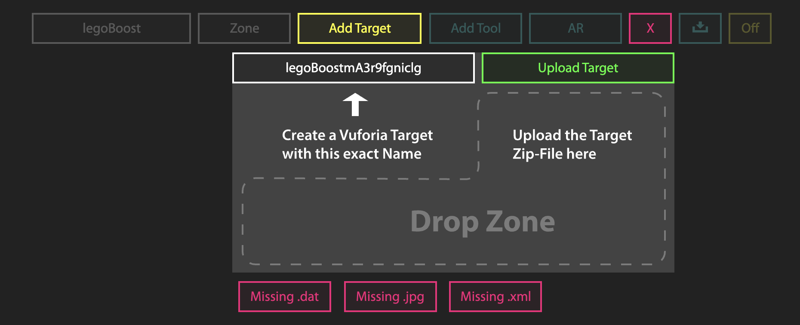
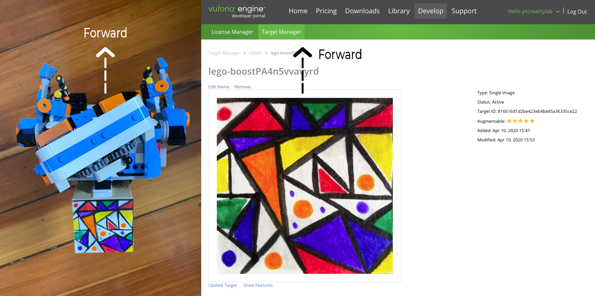
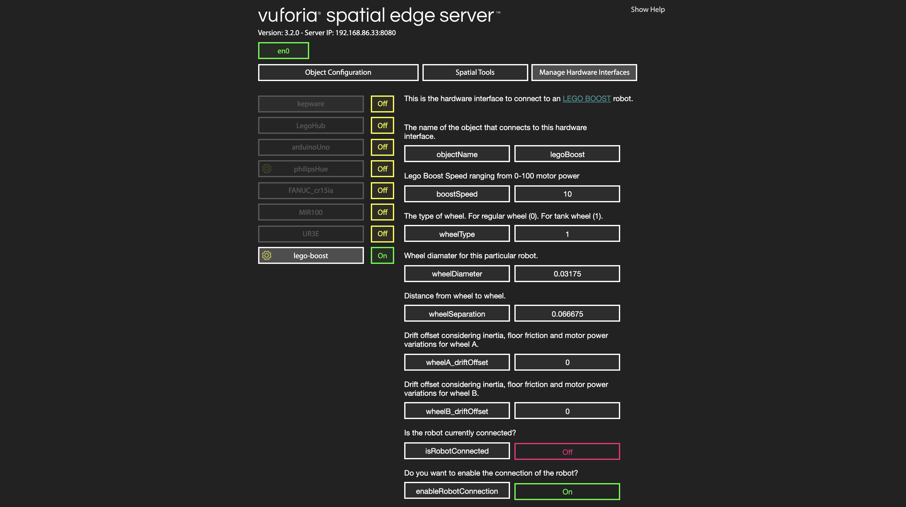
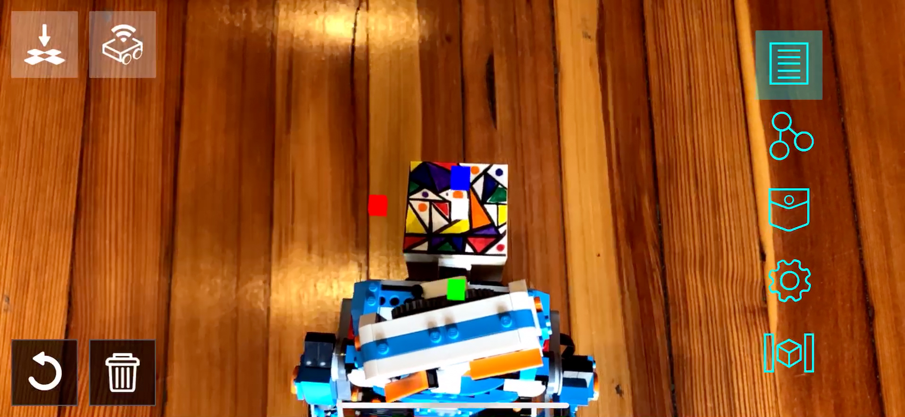
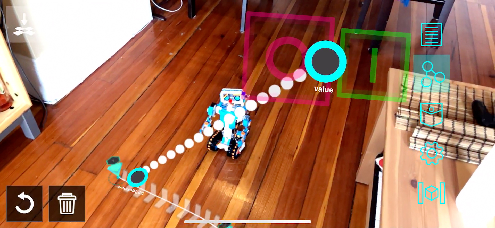

> IMPORTANT NOTE: The accuracy of this interface highly depends on floor friction and motor power that can have small variations from robot to robot. In order to improve the accuracy of the interface make sure you adjust the parameters properly for your own Lego Boost.

## Lego Boost Kinetic AR Prototyping


This is a reference to build a [**Vuforia Spatial Toolbox** (VST)](https://forum.spatialtoolbox.vuforia.com ) path planning prototype using robotic interfaces for a Lego Boost robot. 
This is based on our [**Kinetic AR** UX framework](https://dl.acm.org/doi/pdf/10.1145/3334480.3382814) and it works with two components:
* **[Robotic Addon Interface](../../)** [To connect to the robot hardware]
* **Motion Tool** [AR UI when looking at the robot with your mobile device]

It allows a connection to the robot and a spatial synchronization 
between the robot coordinate system and the Vuforia groundplane coordinate system. 
It also allows for path planning.

### Getting Started

These instructions will explain how to setup the Lego Boost robotic addons and tools. 
You will have to clone or download the code for the VST repositories as explained later.

#### Prerequisites

* A Lego Boost robot running on 2 wheels (either tank or regular)
* A laptop to be able to run the Vuforia Spatial Edge Server
* A mobile phone with the Vuforia Spatial Toolbox application installed
* You will also need the [Vuforia](https://developer.vuforia.com/) object target or image target to identify the robot with the mobile device [Later explained]

### Download code

1. Download the [vuforia-spatial-edge-server](https://github.com/ptcrealitylab/vuforia-spatial-edge-server) code and place it in your Development folder on your computer.

2. Download the [vuforia-spatial-robotic-addon](https://github.com/ptcrealitylab/vuforia-spatial-robotic-addon) code and place it in the following folder:

```
vuforia-spatial-edge-server/addons/
```

This folder contains all the code you need for your robotic addon. A robotic addon is in charge of communicating with a specific piece of hardware/robot.
The robotic addon interface will be in charge of talking to the robot and generating the specific nodes and logic needed for path planning.

### Installing Node.js

In order to run the server, you will need Node.js installed on your computer. 
Install [node.js](https://nodejs.org).<br />
Open a terminal window and navigate to your vuforia-spatial-edge-server folder.
Run the following:

```
npm install
```

This will install all the Node.js dependencies needed in your VST Server. 

Now navigate to your vuforia-spatial-robotic-addon folder and npm install again:

```
npm install
```

This will install all the Node.js dependencies needed in your robotic addon folder.

### Running your VST server

Now, go back to your root folder (vuforia-spatial-edge-server/) and you can run the server as follows:

```
node server
```

With your server running, open a browser and go to:

```
localhost:8080
```

The vuforia-spatial-edge-server interface should load on the browser. 
Here, you will find a list with all the VST Objects available.
The first time you run the VST Server, it will be empty.

 

### VST Objects

In your computer, the VST Objects are stored in the following folder:

```
Documents/spatialToolbox
```

This folder gets generated the first time you run the Reality Server.

### KineticAR Object and Motion Tool

You will need a virtual object that will represent your physical object (your robot) and a motion tool attached to it. 
> An object is a reference to your world physical object (aka your robot). 
The tool is a piece of AR content that will be attached to your physical object or physical surroundings [it is, essentially, the AR user interface].<br /> 

#### Creating trackable object

Your object will need a Vuforia object target in order to be identified and tracked.
You will have to generate this object target from the Vuforia Developer Portal. But first, you need to know the name of your target. Do the following:

With the server running, follow this steps on the VST Server interface on your browser:

* Click on 'Add Object'. Give this object the name of your robot: 'legoBoost'.
* Click on 'Add Target'

The interface will ask you to create a Vuforia Target with the name provided. 

 

This name (that follows the pattern: legoBoost+ABunchOfLettersAndNumbers) is the name you need when generating your Vuforia Target.

Now go to the [Vuforia Developer Portal](https://developer.vuforia.com/).<br />
Go to the Target Manager and add a new target. This target must be a Vuforia target that the robot has attached to it. In our example, we use an image target on the back of the robot:


When you create your target it is very important that you follow the direction convention used by the interface.
You must ensure that the top part of the image on the Vuforia Developer Portal is directed towards the front of your physical robot.
If this is not correct, the robot will not follow the path properly.



When prompted, add the name you got from the VST interface (legoBoost+ABunchOfLettersAndNumbers).

Download the target when processed. 
When asked to select a development platform, select the option Android Studio, Xcode or Visual Studio.

#### Creating a VST tool through the VST server

Once you have downloaded your object/image target follow this steps on the VST Server interface on your browser:

On the 'Add Target' interface:
* Drop zip file or separate files (dat, xml and jpg) to the drop zone. The [OFF] button should turn to [ON]
* Click on 'Add Tool'. Give this tool the following name: 'kineticAR'

At this point, if you go to your file system and navigate to the spatialToolbox folder, you should see that a folder has been created for your object and your tool.

```
Documents/spatialToolbox/legoBoost/kineticAR
```

Make sure that this folder has been generated. In this tool folder the system will host the code that will generate the KineticAR tool once you detect your robot.
By default you will see two files: index.html and bird.png. <br />
Alternatively, in this folder, you can develop your own tools to be used when tracking your object.
For our example on KineticAR, the system will automatically copy the tool from the robotic addon interface. So, on to that:

### Configure robot

The Lego Boost robotic addon has configuration settings that you can change through the server browser interface.

Follow the next steps:

Run the server from the root folder:

```
node server
```

Go to the server in the browser:

```
localhost:8080
```

Select 'Manage Hardware Interfaces'.

You will see a list of the hardware interfaces that are on your server. You can turn them on and off.

Turn the lego-boost hardware interface on.
Now restart the server again.

```
node server
```

Go back to the browser interface, to ManageHardwareInterfaces and click on the yellow gear next to legoBoost for configuration.
You will see the configuration parameters for the Lego Boost robot as follows:

 

Modify the parameters to match your configuration.
Make sure the object name is the same one as the object you have created ('legoBoost').
Finally, set enableMIRConnection to true, so that the software tries to connect to the robot.

Once this is all setup, stop your server. Go to the next section: Testing.

### Testing

At this point, you have everything setup and you should test to make sure that everything works together.
Follow these steps to ensure that your code runs properly.

* Make sure the computer running the server and the smartphone with the Vuforia Spatial Toolbox application are on the same network.
* On your terminal, navigate to the folder 'vuforia-spatial-edge-server/'
* Run the server by typing:

```
node server.js
```

* Open the browser and go to:
```
localhost:8080
```

* Go to ManageHardwareInterfaces
* Your robot hardware interface should be ON.
* Check that the isRobotConnected parameter is set to ON. This means the connection to the robot was successful

* Open the Vuforia Spatial Toolbox application on the phone, POINTING AT THE FLOOR (or surface where your robot will be moving on). The first time the application sees a surface, it will register this surface as the floor. We are currently in the process of implementing user feedback for this. For now, just make sure that you are pointing at the floor when you turn on the application.
* On the side menu on the phone, click on the configuration gear
* Go to 'Found Objects'

Here, you will see a list of Objects that the server is looking for. Your object should be on this list.<br />
If your object is not on this list, something went wrong. Check out our troubleshooting section.

If your object is on the list, point with the phone at your physical object (aka your robot).
If your object target works, the main UI of the motion tool should show up on the device.



Now you can point on the floor and tap at any new position where you want a new checkpoint. You will see how a path gets created as you add more checkpoints on the floor.
Once your path is finished. Connect a button to the first checkpoint.



 When you activate this button, the robot will start following the path.
 
 

### Authors

* **[Anna Fuste](https://github.com/afustePTC)**

See also the list of [contributors](https://github.com/ptcrealitylab/vuforia-spatial-robotic-addon/contributors) who participated in this project.

### License

This project is licensed under the MPL 2.0 License - see the [LICENSE](https://github.com/ptcrealitylab/vuforia-spatial-robotic-addon/blob/master/LICENSE) file for details

### Acknowledgments

* Hat tip to anyone whose code was used
* We thank Robb Stark for being on our wall watching all of us during the development process
